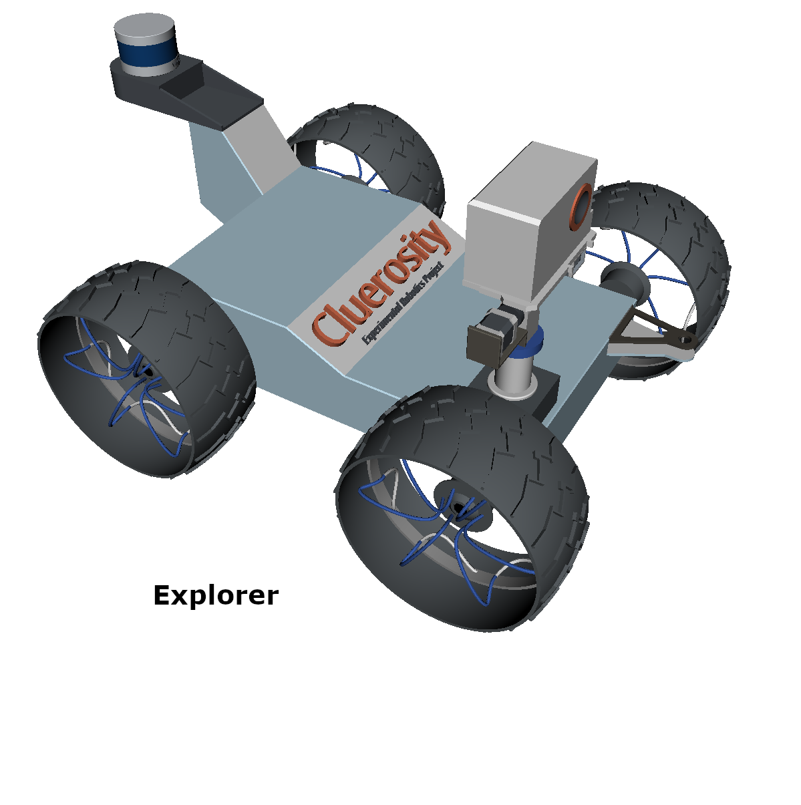
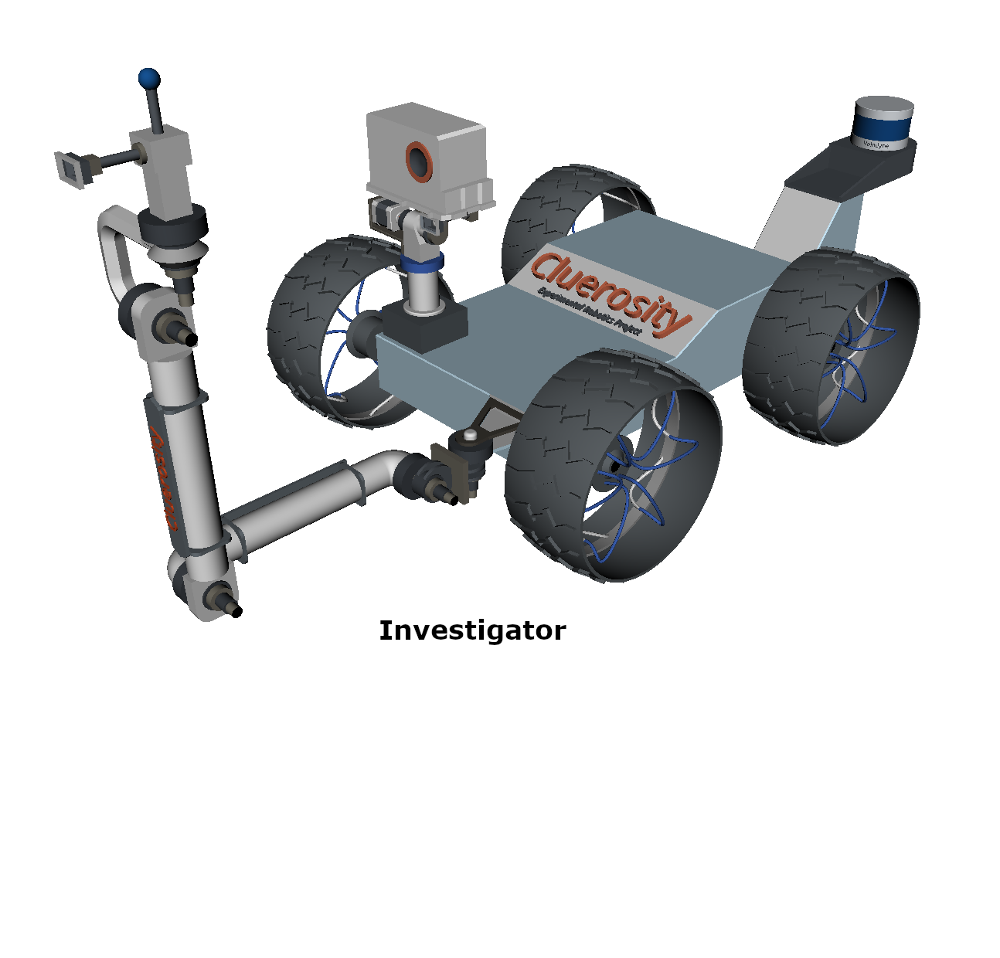

# Experimental Robotics Lab Project (Version 2.0)

>**Author: Omotoye Shamsudeen Adekoya**  
 **Email: adekoyaomotoye@gmail.com**  
 **Student ID: 5066348**

# Project Progress Outline

1. [First Assignment (Version 1.0)](https://github.com/Omotoye/Experimental-Robotics-Project/tree/version-1)
1. Second Assignment (Version 2.0)
1. Final Assignment (Version 3.0)

*The Experimental Robotics Lab **Second Assignment** in progress! README Update coming soon!!!. [Click Here](https://github.com/Omotoye/Experimental-Robotics-Project/tree/version-1) to go to the github branch of **First Assignment (Version 1.0)** of the Experimental Robotics Lab Project*

## Cluerosity

Below is the mobile robot designed for the Experimental Robotics Lab Assignment 2 and 3.

[Click Here](https://github.com/Omotoye/cluerosity) to see the work being done on this mobile robot...
